<picture><source media="(prefers-color-scheme: dark)" srcset="./assets/banner-dark.svg"></picture>

# Samuel Metcalfe

**Software engineer: reliable distributed systems, payments infrastructure and blockchain protocols**

Open to software engineering roles, remote and relocating. Reach me by email: `contact[at]samuelmetcalfe[dot]com`.

I'm a software engineer who has specialised in backend infrastructure for blockchain protocols. Most of my recent public work has been building Direct Indexing Payments (DIPs) for The Graph.

---

## Selected work

### [dipper](https://github.com/edgeandnode/dipper) (Rust)

I owned the dipper codebase from December 2025 to September 2026. dipper is a payments gateway for The Graph that manages Direct Indexer Payments on The Graph.

Components include (but are not limited to):
- Postgres
- RPC
- gRPC
- On-chain indexing agreement offers
- Escrow management

[See my merged changes](https://github.com/edgeandnode/dipper/pulls?q=is%3Apr+author%3AMoonBoi9001+is%3Amerged).

### [subgraph-dips-indexer-selection](https://github.com/edgeandnode/subgraph-dips-indexer-selection) (Python)

I owned this repo from prototype to production deployment. This service picks which indexers are selected to receive paid subgraph indexing agreements. It runs a daily job that replays over a billion gateway query records from Redpanda and takes a selection of that data for a linear regression to determine which indexers have the best latency score. This score is then used as a contributing factor in indexer selection, blended with other factors such as indexer price, uptime and success rate.

[See my merged changes](https://github.com/edgeandnode/subgraph-dips-indexer-selection/pulls?q=is%3Apr+author%3AMoonBoi9001+is%3Amerged).

### [indexer-rs](https://github.com/graphprotocol/indexer-rs) (Rust)

This is the service indexers run to receive, verify and answer indexing agreement proposals. I contributed to it between January and September 2026.

[See my merged changes](https://github.com/graphprotocol/indexer-rs/pulls?q=is%3Apr+author%3AMoonBoi9001+is%3Amerged).

### [rewards-eligibility-oracle](https://github.com/graphprotocol/rewards-eligibility-oracle) (Python)

This oracle decides which indexers qualify for The Graph's indexing rewards and records the decision into the [RewardsEligibilityOracle contract](https://arbiscan.io/address/0x02753bae61c08abd4351bce7f48524935c2cc78e) on Arbitrum. I built the service and wrote the eligibility criteria it enforces: a rolling 28-day window counting the days an indexer served queries that met published thresholds for response status, latency and data freshness. I then took it to production: RPC failover and gas bounds so the daily submission survives unreliable providers, a circuit breaker so a failing run cannot loop into expensive retries, and Slack and Opsgenie alerting. [Merged changes](https://github.com/graphprotocol/rewards-eligibility-oracle/pulls?q=is%3Apr+author%3AMoonBoi9001+is%3Amerged).

---

<a href="https://gitroll.io/profile/u4zzWIZNh81XISOBbHHDCgSkU2om2"><picture><source media="(prefers-color-scheme: dark)" srcset="https://gitroll.io/api/badges/profiles/v1/u4zzWIZNh81XISOBbHHDCgSkU2om2?theme=dark"></picture></a>

