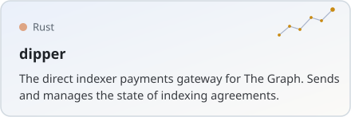
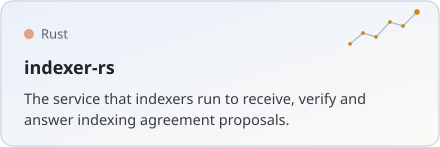
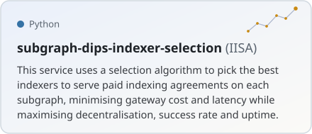
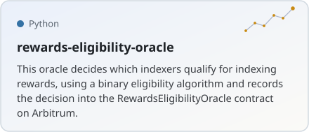

<picture><source media="(prefers-color-scheme: dark)" srcset="./assets/banner-dark.svg"></picture>
# Samuel Metcalfe

**Software engineer: reliable distributed systems, payments infrastructure and blockchain protocols**

Open to software engineering roles, remote and relocating. Reach me by email: `contact[at]samuelmetcalfe[dot]com`.

I'm a software engineer who has specialised in backend infrastructure for blockchain protocols. Most of my recent public work has been building Direct Indexing Payments (DIPs) for The Graph.

---

## Selected work

<!-- selected work: generated by assets/build.py -->

<picture><source media="(prefers-color-scheme: dark)" srcset="./assets/cards/the-graph-dark.svg"></picture>

<a href="https://github.com/edgeandnode/dipper"><picture><source media="(prefers-color-scheme: dark)" srcset="./assets/cards/dipper-dark.svg"></picture></a>
<a href="https://github.com/graphprotocol/indexer-rs"><picture><source media="(prefers-color-scheme: dark)" srcset="./assets/cards/indexer-rs-dark.svg"></picture></a>
 
<a href="https://github.com/edgeandnode/dipper/pulls?q=is%3Apr+author%3AMoonBoi9001+is%3Amerged"><picture><source media="(prefers-color-scheme: dark)" srcset="./assets/cards/merged-dark.svg"></picture></a>
<a href="https://github.com/graphprotocol/indexer-rs/pulls?q=is%3Apr+author%3AMoonBoi9001+is%3Amerged"><picture><source media="(prefers-color-scheme: dark)" srcset="./assets/cards/merged-dark.svg"></picture></a>

<a href="https://github.com/edgeandnode/subgraph-dips-indexer-selection"><picture><source media="(prefers-color-scheme: dark)" srcset="./assets/cards/subgraph-dips-indexer-selection-dark.svg"></picture></a>
<a href="https://github.com/graphprotocol/rewards-eligibility-oracle"><picture><source media="(prefers-color-scheme: dark)" srcset="./assets/cards/rewards-eligibility-oracle-dark.svg"></picture></a>
 
<a href="https://github.com/edgeandnode/subgraph-dips-indexer-selection/pulls?q=is%3Apr+author%3AMoonBoi9001+is%3Amerged"><picture><source media="(prefers-color-scheme: dark)" srcset="./assets/cards/merged-dark.svg"></picture></a>
<a href="https://github.com/graphprotocol/rewards-eligibility-oracle/pulls?q=is%3Apr+author%3AMoonBoi9001+is%3Amerged"><picture><source media="(prefers-color-scheme: dark)" srcset="./assets/cards/merged-dark.svg"></picture></a>

<!-- end of selected work -->

---

<a href="https://gitroll.io/profile/u4zzWIZNh81XISOBbHHDCgSkU2om2"><picture><source media="(prefers-color-scheme: dark)" srcset="https://gitroll.io/api/badges/profiles/v1/u4zzWIZNh81XISOBbHHDCgSkU2om2?theme=dark"></picture></a>

